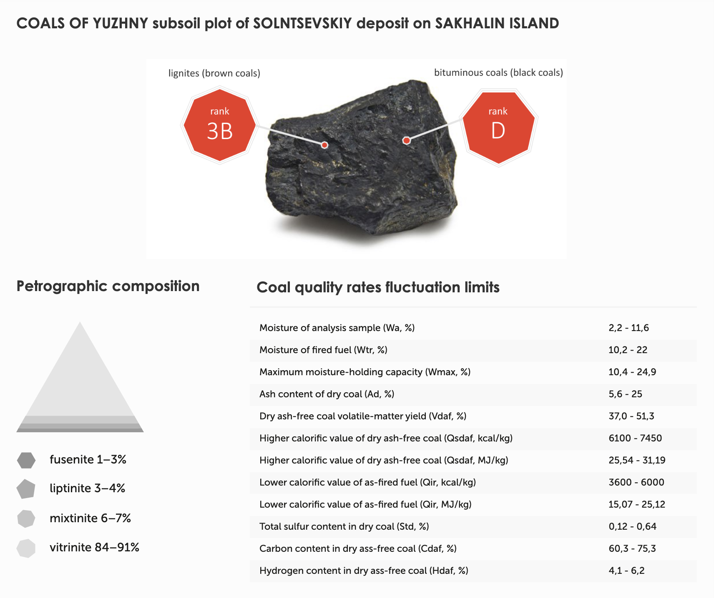

# About the company

### East Mining Company

> Major producer of thermal coal in Sakhalin region

We are among major Russian exporters of brown coal to countries of Asia-Pacific region.

We control the full cycle from the extraction to the shipment of our product. Our Sakhalin coal reserves have more than 300 million tons (confirmed by State), and a prospected reserve in Magadan region of more than 100 million tons.

Our key production assets are Solntsevsky coal mining site (Uglegorsk district of Sakhalin region) and, from 2013, the coal seaport of Shakhtersk, that has the status of a free port.

Our production portfolio includes 3B and D lignites and bituminous coals, and also anthracites, natural thermoanthracites and bituminous coke coals GJ, J, K.

#### Vision

Being the largest coal mining company in the Sakhalin region, we look forward to becoming one of the major Russian steam coal exporters to the Asia-Pacific countries.

Growing volumes, stable high production quality, and continuous optimization of our logistic chain will guarantee future growth of international target markets; and continuous development along with improvement of infrastructure and internal business processes will allow us to gain the status of one of the most efficient coal mining companies of Russia.

#### Our History

* **1983** - Start of experimental mining
* **1986** - 435 thousand tons mined as the result of exploration stage
* **1987** - Solntevsky Coal Mine became the first company to use open cast mining in Uglegorsk district
* **2003** - 4,4 million tons mined between 1987 and 2003
* **2011** - The company bought licenses to work at Yuzhnuy-2 site with more than 130 million tons of reserves
* **2011** - The company acquired Shakhtersk port
* **2013** - Port modernization with capacity growth up to 3 million tons
* **2013** - East Mining Company was created, uniting Solntsevsky Coal Mine, anthracite sites in Magadan, and sea coal port Shakhtersk
* **2015** - Elaboration of documents to the complex development of the site and port with the help of consulting companies: McKinsey, RPM Consulting, Royal Haskoning
* **2016** - For the first time, mining volumes reached 4 million tons per year. East Mining Company was listed among 50 most rapidly growing companies by RBC agency
* **2017** - East Mining Company became a resident of Vladivostok free port. Shakhtersk port was listed among the five Russian leaders in cargo turnover
* **2018** - The mining and shipment performance for the year exceeded 7.5 million tons of coal
* **2018** - More than 500 additional jobs were created in the Uglegorsky district
* **2019** - The Company has increased coal mining volumes by 21% and shipment volumes - by 17%
* **2019** - The coal sea port of Shakhtersk was listed among the top ten largest coal transfer ports in Russia
* **2020** - EMCO started the principal construction stage of the main coal conveyor, which will connect the Solntsevsky coal mine with the Shakhtersk sea port

# Coal ranks and caloric value

# Assets

## Solntsevsky Coal Mine LLC

Proven coal reserves of more than 300 mln.tons provide a long-term resource base for the company.

> Solntsevsky Coal Mine was the first company in Uglegorsk district to arrange open-cast mining.

Mine operates the sites “Yuzhnuy-1” and “Yuzhnuy-2” of Solntsevsky coal deposit (Uglegorsk district, Sakhalin region).

Solntsevskoye CJSC developed the stated reserve within the period from 1987 to 2003 with the production extent exceeding **4.4 mln.tons**. In 1983 - 1986 experimental coal mining in terms of the mineral survey was arranged at the site with the total extent of production making 435 th.tons.

According to the production modernization and time-phased performance build-up investment program the mining and auxiliary technician yard was totally renewed and extended.

At the coalmine, we use modern and highly efficient equipment of the leading manufactures, such as BELAZ, Komatsu, Hitachi etc. Solntsevsky Coal Mine is the Sakhalin only coal extracting company using the power shovels with bucket capacity of 22-23m³.

Automatic dispatching system was implemented at the coalmine beyond the measures of shutdown reduction and efficiency build-up program. In addition, the repair areas for manufactures were arranged.

Solntsevsky Coal Mine is one of the key employers not only in this area, but also for all Sakhalin region. The number of staff is now over one thousand people. In addition, the company provides jobs for more than 700 employees of contractors and subcontractors operating in Uglegorsk district.

The company contributes significantly to the region’s economic improvement, being one of the most important taxpayers. The amount of tax payments for the period of 2012-2018 toped 4,9 billion rubles.

## Coal Sea port of Shakhtersk LLC

Coal Sea Port of Shakhtersk is the major sea terminal of the East Mining Company. It is located in Shakhtersk, Uglegorsk district, the main coal extracting company, is 28 km. According to the 2017-2018 berthing and loading capacities modernization and development package program the current capacity of the coastal loading cluster allows processing more than 4.4 th.t of coal per hour.

> According to the results of 2018, the volume of warehouses, located in the territory of the Coal Sea Port of Shakhtersk has topped 2.5 billion ton.

The program of the road loading, which is unique for Russia, is implemented in this seaport. According to this program, coal is loaded to the 120 th.t. deadweight bulk carriers. The own fleet of vessels with load capacity of 650 t, 1.7 th.t. and 3.5 th.t. is used for the delivery of coal to road.

Coal Sea Port of Shakhtersk is one of the most perspective and appealing for employers not only in Uglegorsk district but also in the Sakhalin region in general.

> Today the company employs more than 600 people.

## North-Eastern Coal Company Limited

The company is located in Omsukchansky and Srednekansky districts of Magadan region (geological survey and production sites), Pestraya Dresva bay of Sea of Okhotsk (future sea loading complex).

> The company has 3 licenses to explore coal deposits in Omsukchansky basin
>
> (+ 2 objects with reserves in unallocated subsoil reserve fund).

Anthracites, natural thermoanthracites and soft coal, including close-burning grades ГЖ, Ж, К.

> Market outlets: Asian and Pacific Rim: Korea, Japan, China, Taiwan, Vietnam.

The first pilot batches of filtering materials were obtained from Omsukchansky basin anthracites, corresponding to GOST Р 51641-2000 “Filtering granular materials”, sanitary and epidemiological regulations. Product certificate will be obtained in July 2016.

The company commenced experimental works on oily water effluents treatment, which brought positive results – enterprises are ready to buy anthracite FM. FM production research works are supported by Magadan region administration.

Experimental batches of AC (active coal) NECC from anthracites are currently tested by potential consumers (gold and silver hydrometallurgy, deep treatment of industrial wastes).

Omsukchansky basin anthracite active coal can be potentially used in hydrometallurgical technology of rare earth metal extraction from the minerals of world's No. 1 Tomtor rare metal field, which is currently widely developed and to ensure the environmental safety of future production.

